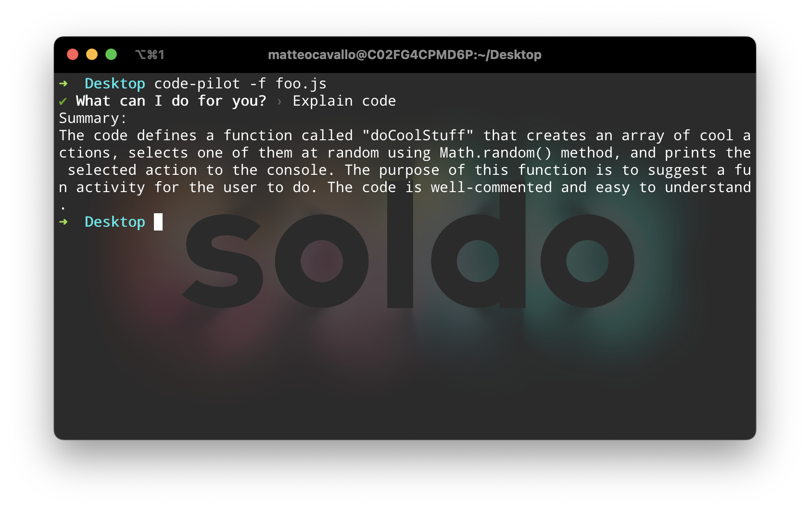
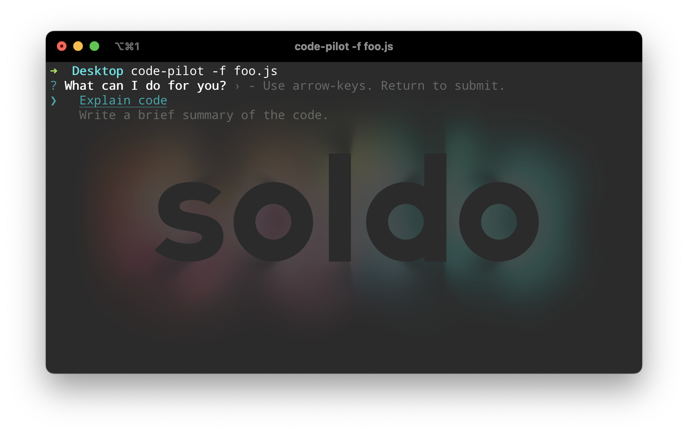
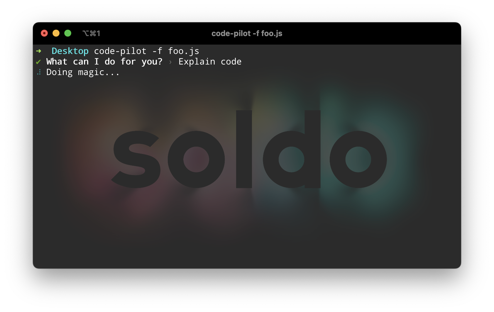

# 🪄 code-pilot
CodePilot is an npm package that can help you navigate and understand complex code by providing quick and concise summaries of your code. With CodePilot, you no longer need to spend hours poring over lengthy code files or documentation to understand a project's inner workings.

## Features
- Quickly generate summaries of code with just a few simple commands
- Customizable prompts and output formatting for a tailored user experience
- Seamlessly integrate with other development tools and workflows


## Getting Started
1. Install CodePilot using npm:
```bash
npm install -g code-pilot
```
Make sure you're using node >= 18 so fetch is available
2. Get your OpenAI API key from the OpenAI API website

3. Run the CodePilot CLI tool and follow the prompts:

```bash
code-pilot
```

4. Enjoy the magic of CodePilot as it generates concise summaries of your code.
## Usage
CodePilot offers a simple command-line interface that lets you quickly generate code summaries. Simply run the code-pilot command and follow the prompts to enter your OpenAI API key and the file path to your code. CodePilot will then generate a summary of your code and display it in the console.

You can also customize the prompts and output formatting by passing in options to the code-pilot command. See the documentation for more details.

## Contributing
We welcome contributions from anyone! If you have an idea for a new feature or want to fix a bug, please submit a pull request or create an issue on GitHub. See CONTRIBUTING.md for more information.

## License
CodePilot is released under the [MIT](https://opensource.org/license/mit/) License.

## Showcase


